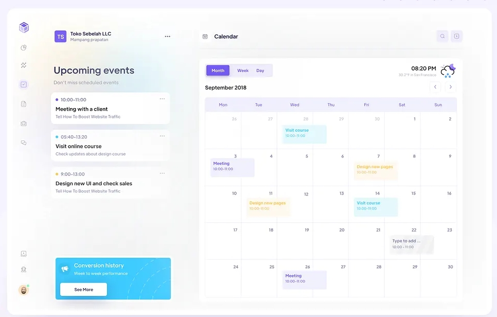

# Sprint 14 Plan: Calendar Dashboard Overhaul (Color-Coded, Actionable)

## Reference Layout (Design Template)

**Project**: TimeFlow  
**Duration**: 2 weeks  
**Status**: Planned (documentation-only)  
**Template**: Inspired by the provided “Upcoming events + Calendar” dashboard layout (left rail + main calendar).

---

## Why this sprint is before Meeting Scheduling

Meeting scheduling (booking links + availability) will feel incomplete if the Calendar page is just a passive view. Sprint 14 upgrades `/calendar` into a planning hub so Sprint 15 can layer “plan meetings from context” cleanly.

---

## Goals

- [ ] `/calendar` becomes a dashboard: Upcoming Events, Unscheduled Tasks, and Calendar in one layout.
- [ ] Strong color coding:
  - tasks use category colors
  - external events are visually distinct and readable
- [ ] Preserve all existing calendar functionality:
  - Smart Schedule button
  - task reschedule DnD
  - task actions (unschedule/delete)
  - event/task popovers
- [ ] Reserve space for future meeting planning UI (placeholder panel only).

---

## Current Implementation (What we must not break)

Key files:
- Page: `timeflow/apps/web/src/app/calendar/page.tsx`
- Calendar component: `timeflow/apps/web/src/components/CalendarView.tsx`

Existing capabilities:
- Fetch external events via `api.getCalendarEvents(...)`
- Render tasks (category colors supported via `event.categoryColor`)
- Drag/drop reschedule tasks in calendar grid
- Task action modal and event detail popovers

---

## Proposed Layout (based on the reference image)

### Left rail

1) **Upcoming events** (external calendar events)
- list view with colored dot + time range + title
- clicking opens detail popover (read-only initially)

2) **Unscheduled tasks**
- list of `status=unscheduled` tasks
- quick actions: schedule, complete, delete (as available)
- drag task into calendar to schedule

3) **(Future) Plan meeting**
- placeholder panel with disabled controls + CTA (“Coming in Sprint 15”)

### Main panel

- Month/Week/Day toggle (existing `react-big-calendar` views)
- Color-coded events:
  - tasks: category color
  - external events: distinct styling (not all gray)
- Legend and quick filters (optional P1):
  - show/hide tasks vs external events
  - show/hide categories

---

## Engineering Tasks (Implementation Guidance)

- Refactor calendar page into a “dashboard shell” component and keep `CalendarView` intact.
- Build new panels as dedicated components:
  - `UpcomingEventsPanel`
  - `UnscheduledTasksPanel`
  - `PlanMeetingsPlaceholderPanel`
- Ensure consistent styling with the rest of the app:
  - reuse existing `surface-card`/layout primitives where possible
  - keep typography + spacing consistent with Today/Tasks

---

## Acceptance Criteria

- [x] `/calendar` has left rail panels + main calendar panel matching the reference layout.
- [x] Tasks show category color coding reliably.
- [ ] External events use AI categorization and show category colors (NOT gray).
- [x] All existing calendar flows still work (reschedule, smart schedule, task actions).
- [x] A "Plan meetings (Coming soon)" placeholder exists and does not break anything.

---

## Implementation Progress

### ✅ Completed (2025-12-26)

**Dashboard Layout**:
- [x] Refactored `/calendar` into dashboard shell with left rail + main panel
- [x] Implemented responsive grid layout (12-column)
- [x] Added MiniCalendar component with date navigation
- [x] Added TimeBreakdown panel showing category distribution
- [x] Added UpcomingEventsPanel (next 7 days preview)
- [x] Added UnscheduledTasksPanel with drag-to-schedule
- [x] Added PlanMeetingsPlaceholderPanel (Sprint 15 preview)

**Visual Polish**:
- [x] Removed panel gaps for seamless stacking
- [x] Fixed calendar scrolling (6 AM - midnight range)
- [x] Improved event text readability across all durations
- [x] Added premium header branding (gradient, animated icon)
- [x] Changed Smart Schedule button from purple to brand teal
- [x] Ensured category legend matches task colors

**Functionality**:
- [x] Date navigation: Clicking MiniCalendar dates navigates main calendar
- [x] Drag & drop: Tasks from panel to calendar slots
- [x] Event resize: Drag bottom edge to adjust duration
- [x] Event detail popover with actions (complete, edit, unschedule, delete)
- [x] Preserved all existing calendar features (no regressions)

**Files Modified**:
- `apps/web/src/app/calendar/page.tsx` - Dashboard layout
- `apps/web/src/components/CalendarView.tsx` - Calendar grid with DnD
- `apps/web/src/components/MiniCalendar.tsx` - Month view widget
- `apps/web/src/components/TimeBreakdown.tsx` - Category time stats
- `apps/web/src/components/UpcomingEventsPanel.tsx` - Event list
- `apps/web/src/components/UnscheduledTasksPanel.tsx` - Draggable task list
- `apps/web/src/components/PlanMeetingsPlaceholderPanel.tsx` - Placeholder
- `apps/web/src/app/globals.css` - Calendar scrolling overrides

### 🚧 In Progress / Needs Refinement

**AI Event Categorization** (Core Feature - See `SPRINT_14_AI_EVENT_CATEGORIZATION.md`):
- [ ] Database: Add `EventCategorization` model
- [ ] Backend: AI categorization service using Claude API
- [ ] API: Endpoints for categorization operations
- [ ] Frontend: Display external events with category colors
- [ ] UI: Manual category override in event popover
- [ ] Initial categorization flow for existing events

**Current State**: External events display in gray striped pattern. Need to implement AI categorization so they use category colors like tasks.

**Why This Matters**: Users expect a unified, color-coded calendar where ALL events (tasks + external) follow the category system. This is a core differentiator of TimeFlow's AI-powered experience.

---

**Last Updated**: 2025-12-26

