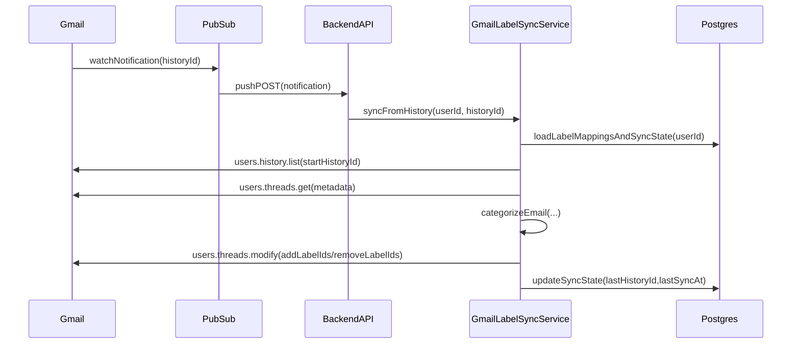

# Sprint 15 Implementation Guide: Gmail Label Sync (Thread-Level)

This guide is written to maximize engineering success. It assumes the existing TimeFlow Gmail inbox integration and email categorization are already in place.

---

## Executive Summary

We will create **real Gmail labels** for TimeFlow categories and apply them to **threads**. Background sync uses Gmail `watch` + Pub/Sub push notifications; if that’s not viable, we fall back to a bounded sync during inbox fetch.

Primary references:
- Gmail API concepts: labels, threads, history, watch
- Existing TimeFlow components: Gmail inbox fetch + category settings

---

## Glossary

- **Category**: TimeFlow email category (`personal`, `work`, `finance`, etc.).
- **Label**: Gmail label object (has `id`, `name`, optional `color`).
- **Thread**: Gmail conversation thread (multiple messages).
- **History**: Gmail change log stream, keyed by monotonically increasing `historyId`.
- **Watch**: Gmail feature that publishes mailbox change notifications to Pub/Sub.

---

## Target UX (Product Spec)

### Label naming

- Default: `TimeFlow/<CategoryName>` (e.g., `TimeFlow/Work`)
- User can override the label name per category.
- **Do not** delete labels on disable by default (avoid user surprise); disabling stops sync only.

### Label colors

- TimeFlow category colors are hex codes.
- Gmail label colors must be mapped into Gmail-supported color values.
- Provide a per-category override UI to choose from the Gmail palette.
- **Reality check**: the Gmail label API supports a `color` object with `backgroundColor` and `textColor`, but you should treat this as a **palette selection** rather than “any hex we want” for v1 stability.

---

## Architecture

### Data flow

---

## Data Model (Proposed)

### Extend per-user category overrides

Existing storage already includes per-user email category config. Extend it with:

- `gmailSyncEnabled` (boolean): whether this category participates
- `gmailLabelId` (string): Gmail label ID
- `gmailLabelName` (string): label name to create/ensure
- `gmailLabelColorBg`, `gmailLabelColorText` (strings): Gmail palette values

### Add per-user sync state

Add a `GmailLabelSyncState` row per user:

- `enabled` (boolean)
- `lastHistoryId` (string)
- `watchExpiration` (datetime)
- `lastSyncAt` (datetime)
- (recommended) `lastErrorAt`, `lastErrorMessage`

---

## Gmail API Operations (Implementation Notes)

### Ensure labels exist

Operations:
- List labels: `users.labels.list`
- Create label: `users.labels.create`
- Patch label color/name: `users.labels.patch`

Notes:
- Treat label creation as idempotent: list by name first; create only if missing.
- Always keep the **label ID** as source of truth once created.

Docs:
- [Gmail API users.labels](https://developers.google.com/gmail/api/reference/rest/v1/users.labels)

### Label color model (what to store)

Persist the Gmail label color as:

- `backgroundColor` (string)
- `textColor` (string)

These map directly to the Gmail label `color` payload used by `create`/`patch`.

### Apply labels to threads

Operation:
- `users.threads.modify`

Behavior:
- Add `TimeFlow/<Category>` label ID to the thread.
- Optionally remove previously applied TimeFlow category labels to enforce a single category (recommended). Keep this behind a “single-category-per-thread” rule to avoid surprises.

Docs:
- [Gmail API users.threads](https://developers.google.com/gmail/api/reference/rest/v1/users.threads)

### Background sync via History

Operations:
- Start watch: `users.watch`
- Read changes: `users.history.list` (from `startHistoryId`)

Docs:
- [Gmail API users.watch](https://developers.google.com/gmail/api/reference/rest/v1/users/watch)
- [Gmail API users.history](https://developers.google.com/gmail/api/reference/rest/v1/users.history)

Critical details:
- History IDs can become invalid if too old; handle `404`/`historyId` errors by resetting (do a bounded “recent threads” resync).
- Dedupe processing by `(userId, historyId)`; allow at-least-once delivery.

---

## Color Mapping Strategy

### Requirements

- Never crash on unexpected colors.
- Prefer stable mapping: same input hex should map to same Gmail palette entry.
- Allow user override.

### Recommended implementation

1. Maintain a fixed Gmail palette list (pairs of `{ bg, text }`).
2. Convert both input hex and palette backgrounds to a color space (RGB is fine; LAB is better).
3. Choose nearest background color by distance.

If you don’t want a dependency, use simple Euclidean distance in RGB:
\n\n- \(d = (r1-r2)^2 + (g1-g2)^2 + (b1-b2)^2\)

### UI implementation (Settings)

Build a per-category editor that includes:

- **Label name input** (default `TimeFlow/<CategoryName>`)
- **Palette picker** (swatches) for Gmail label color:
  - Store the selected `{ backgroundColor, textColor }`
  - Preview using the selected colors

Important:
- Do not offer arbitrary hex input for Gmail label colors unless you’ve verified Gmail will accept that value reliably; treat the UI as a palette selection.

---

## Sync Semantics (Thread-Level Rules)

Recommended defaults:

- **Single TimeFlow category per thread**: when applying a new TimeFlow category label, remove other `TimeFlow/*` category labels to keep a single source of truth.
- **Do not touch** non-TimeFlow labels.
- Respect per-category `enabled` and `gmailSyncEnabled`.

Edge cases:

- User manually applies/removes TimeFlow labels in Gmail:
  - Option A (strict): next sync reasserts TimeFlow categorization.
  - Option B (soft): if user manually changes a TimeFlow label, stop auto-updating that thread (requires tracking per-thread overrides).

Choose Option A for v1 unless product wants manual override support.

---

## Background Sync: Pub/Sub Push Handler

### Endpoint requirements

- Public HTTPS endpoint.
- Validate requests:
  - If using Pub/Sub push, validate `Authorization` header or verify `aud`/OIDC token depending on configuration.
  - If not validating at the network layer, at least validate payload shape and keep endpoint unguessable/behind WAF.

### Idempotency

- Store `lastHistoryId` per user.
- If an incoming historyId is `<= lastHistoryId`, ignore.
- If processing fails mid-way, do not advance `lastHistoryId`.

### Dedupe

- Use a short TTL in Redis (recommended) keyed by `(userId, historyId)` to avoid double-processing when multiple instances receive retries.

---

## Fallback Sync (Sync-on-Inbox-Fetch)

Trigger: when `/api/email/inbox` is called and watch is disabled/unavailable.

Algorithm:
- Take the returned inbox list, extract unique `threadId`s.
- Process up to `N` threads (e.g., 20) per request.
- Apply labels idempotently.

Safeguards:
- Per-user throttling (tight).
- Always return inbox response first; sync can run async if infrastructure allows.

---

## Endpoints (Suggested Contract)

### Enable sync

- `POST /api/email/label-sync/enable`
  - Ensures labels exist
  - Starts watch
  - Stores sync state

### Disable sync

- `POST /api/email/label-sync/disable`
  - Stops watch (or marks disabled)
  - Keeps existing labels

### Status

- `GET /api/email/label-sync/status`
  - `{ enabled, lastSyncAt, watchExpiration, lastError? }`

### Manual run

- `POST /api/email/label-sync/run`
  - Runs a bounded sync (recent inbox threads or history sync if `lastHistoryId` exists)

---

## Operational Checklist (Deployment)

### Google Cloud Console

- Enable Gmail API.
- Configure OAuth consent screen for consumer users.
- Request/prepare for scope verification for `gmail.modify`.

### Pub/Sub

- Create topic for Gmail watch notifications.
- Create push subscription targeting backend endpoint.
- Configure authentication on push (OIDC recommended).

---

## Test Plan

### Unit tests

- Color mapping chooses expected palette entry.
- Label name normalization avoids invalid names.

### Integration tests (mock Gmail client)

- `enable` creates labels when missing; re-run is no-op.
- `syncFromHistory` applies labels to threads.
- Push handler ignores stale history and dedupes.

---

## Rollout Plan (Recommended)

- Feature flag: `GMAIL_LABEL_SYNC_ENABLED` default off.
- Release to internal accounts first.
- Expand in cohorts and monitor:
  - Gmail API error rates
  - sync latency
  - rate limit hits

---

## Troubleshooting Quick Hits

- Labels created but not colored:
  - verify label `color` patch calls
  - verify palette values are valid
- Push not arriving:
  - verify watch is active and topic configured
  - verify Pub/Sub push auth and endpoint reachability
- `historyId` invalid:
  - reset to bounded recent sync and re-establish watch

---

**Last Updated**: 2025-12-15

