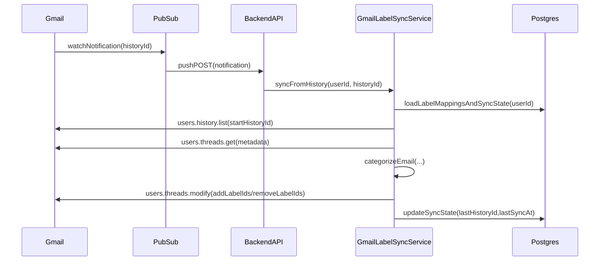

# Sprint 16 Implementation Guide: Gmail Label Sync (Thread-Level)

This guide is written to maximize engineering success. It assumes the existing TimeFlow Gmail inbox integration and email categorization are already in place.

---

## Executive Summary

We will create **real Gmail labels** for TimeFlow categories and apply them to **threads**. Background sync uses Gmail `watch` + Pub/Sub push notifications; if that’s not viable, we fall back to a bounded sync during inbox fetch.

Primary references:
- Gmail API concepts: labels, threads, history, watch
- Existing TimeFlow components: Gmail inbox fetch + category settings

---

## Target UX (Product Spec)

### Label naming

- Default: `TimeFlow/<CategoryName>` (e.g., `TimeFlow/Work`)
- User can override the label name per category.
- **Do not** delete labels on disable by default (avoid user surprise); disabling stops sync only.

### Label colors

- TimeFlow category colors are hex codes.
- Gmail label colors must be mapped into Gmail-supported color values.
- Provide a per-category override UI to choose from the Gmail palette.
- **Reality check**: the Gmail label API supports a `color` object with `backgroundColor` and `textColor`, but you should treat this as a **palette selection** rather than “any hex we want” for v1 stability.

---

## Architecture

---

## Data Model (Proposed)

### Extend per-user category overrides

- `gmailSyncEnabled` (boolean)
- `gmailLabelId` (string)
- `gmailLabelName` (string)
- `gmailLabelColorBg`, `gmailLabelColorText` (strings)

### Add per-user sync state

`GmailLabelSyncState` per user:
- `enabled`
- `lastHistoryId`
- `watchExpiration`
- `lastSyncAt`
- (recommended) `lastErrorAt`, `lastErrorMessage`
- `watchEnabled`
- `watchResourceId`
- `watchTopicName`

---

## Gmail API Operations (Implementation Notes)

### Ensure labels exist

- List: `users.labels.list`
- Create: `users.labels.create`
- Patch: `users.labels.patch`

Docs:
- [Gmail API users.labels](https://developers.google.com/gmail/api/reference/rest/v1/users.labels)

### Apply labels to threads

- `users.threads.modify` (preferred)

Docs:
- [Gmail API users.threads](https://developers.google.com/gmail/api/reference/rest/v1/users.threads)

### Background sync via History

- Start watch: `users.watch`
- Read changes: `users.history.list`

Docs:
- [Gmail API users.watch](https://developers.google.com/gmail/api/reference/rest/v1/users/watch)
- [Gmail API users.history](https://developers.google.com/gmail/api/reference/rest/v1/users.history)

---

## Pub/Sub Push Auth (Background Sync)

The push handler accepts either:

1. **OIDC JWT** from Pub/Sub push auth
   - Validate `aud` matches `GMAIL_PUBSUB_OIDC_AUDIENCE`
   - Optionally restrict by service account email allowlist
2. **Shared secret** header
   - `x-pubsub-token` must equal `GMAIL_PUBSUB_PUSH_SECRET`

This supports secure push delivery even without an edge proxy/WAF.

---

## Watch Renewal Job

Gmail watches expire; renew them on an interval:

- `GMAIL_WATCH_RENEWAL_ENABLED=true` to start the job
- `GMAIL_WATCH_RENEWAL_WINDOW_MINUTES` controls how soon before expiration to renew
- `GMAIL_WATCH_RENEWAL_INTERVAL_MINUTES` controls how often the job runs

If a history sync fails due to stale history, fall back to a bounded sync and reset `lastHistoryId`.

---

## Color Mapping Strategy

### Recommended implementation

1. Maintain a fixed Gmail palette list (pairs of `{ bg, text }`).
2. Choose nearest background color by distance.
3. Allow user override.

### UI implementation (Settings)

- **Label name input** (default `TimeFlow/<CategoryName>`)
- **Palette picker** (swatches) for Gmail label color (store `{ backgroundColor, textColor }`)

---

## Sync Semantics (Thread-Level Rules)

Recommended defaults:
- Enforce **single TimeFlow category per thread** by removing other `TimeFlow/*` category labels.
- Never modify non-TimeFlow labels.
- Apply per-user overrides before heuristics.

---

## Fallback Sync (Sync-on-Inbox-Fetch)

When watch is disabled/unavailable:
- extract threadIds from fetched inbox list
- sync up to N threads per request (bounded)
- strict per-user throttling

---

## Rollout Plan

- Feature flag + per-user toggle
- Beta first, then staged rollout
- Monitor rate limits, error rates, and sync latency

---

**Last Updated**: 2025-12-23

